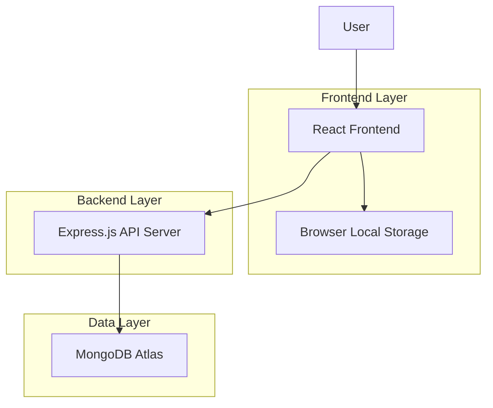

# E-Commerce Website Design Document

## Overview

This design document outlines the technical architecture for a modern E-Commerce Website built with React.js frontend, Node.js/Express.js backend, and MongoDB Atlas database. The system follows a client-server architecture with RESTful APIs, responsive design principles, and efficient state management for optimal user experience across all devices.

## Architecture

### High-Level Architecture



### Technology Stack

**Frontend:**
- React.js 18+ with functional components and hooks
- React Router v6 for client-side routing
- CSS Modules or Styled Components for styling
- Axios for HTTP requests
- Context API + useReducer for cart state management

**Backend:**
- Node.js with Express.js framework
- CORS middleware for cross-origin requests
- Express.json middleware for request parsing
- MongoDB driver for database operations

**Database:**
- MongoDB Atlas for cloud-hosted database
- Collections: products, carts (optional for persistent carts)

**Development Tools:**
- Create React App or Vite for frontend bundling
- Nodemon for backend development
- ESLint and Prettier for code quality

## Components and Interfaces

### Frontend Components

#### Core Components
1. **App Component**
   - Root component managing global state and routing
   - Provides CartContext to child components
   - Handles error boundaries

2. **Header Component**
   - Navigation bar with logo and cart icon
   - Cart item count display
   - Responsive hamburger menu for mobile

3. **ProductGrid Component**
   - Displays products in responsive grid layout
   - Handles loading states and pagination
   - Implements product filtering/search (future enhancement)

4. **ProductCard Component**
   - Individual product display with image, name, price
   - Add to cart button with loading states
   - Hover effects and responsive design

5. **ProductDetail Component**
   - Detailed product view with image gallery
   - Product description and specifications
   - Quantity selector and add to cart functionality

6. **Cart Component**
   - Shopping cart overlay or dedicated page
   - Item list with quantity controls
   - Total calculation and checkout button

7. **CartItem Component**
   - Individual cart item with product info
   - Quantity adjustment controls
   - Remove item functionality

#### Utility Components
- **LoadingSpinner**: Reusable loading indicator
- **ErrorMessage**: Error display component
- **Button**: Styled button component with variants

### Backend API Endpoints

#### Product Endpoints
```
GET /api/products
- Returns paginated list of all products
- Query params: page, limit, search (optional)

GET /api/products/:id
- Returns detailed product information
- Includes full description and image gallery
```

#### Cart Endpoints (Optional - for persistent carts)
```
POST /api/cart
- Creates or updates cart for session/user
- Body: { items: [{ productId, quantity }] }

GET /api/cart/:sessionId
- Retrieves cart for specific session
- Returns cart items with populated product data
```

### State Management

#### Cart Context Structure
```javascript
const CartContext = {
  state: {
    items: [], // [{ product, quantity }]
    totalItems: 0,
    totalPrice: 0,
    isLoading: false,
    error: null
  },
  actions: {
    addToCart: (product, quantity) => {},
    removeFromCart: (productId) => {},
    updateQuantity: (productId, quantity) => {},
    clearCart: () => {},
    loadCartFromStorage: () => {}
  }
}
```

## Data Models

### Product Model
```javascript
{
  _id: ObjectId,
  name: String (required),
  description: String (required),
  price: Number (required),
  images: [String], // Array of image URLs
  category: String,
  inStock: Boolean (default: true),
  stockQuantity: Number (default: 0),
  createdAt: Date,
  updatedAt: Date
}
```

### Cart Item Model (Frontend State)
```javascript
{
  product: {
    _id: String,
    name: String,
    price: Number,
    images: [String]
  },
  quantity: Number,
  subtotal: Number // calculated field
}
```

### Cart Model (Optional - Backend)
```javascript
{
  _id: ObjectId,
  sessionId: String (required),
  items: [{
    productId: ObjectId (ref: 'Product'),
    quantity: Number (required, min: 1)
  }],
  createdAt: Date,
  updatedAt: Date,
  expiresAt: Date // TTL index for cleanup
}
```

## Error Handling

### Frontend Error Handling
1. **Network Errors**
   - Display user-friendly error messages
   - Implement retry mechanisms for failed requests
   - Show offline indicators when appropriate

2. **Validation Errors**
   - Client-side form validation
   - Real-time feedback for user inputs
   - Clear error messaging

3. **State Errors**
   - Error boundaries to catch React component errors
   - Graceful degradation for cart operations
   - Local storage error handling

### Backend Error Handling
1. **API Error Responses**
   - Consistent error response format
   - Appropriate HTTP status codes
   - Detailed error messages for development

2. **Database Errors**
   - Connection error handling
   - Query timeout management
   - Data validation errors

3. **Middleware Error Handling**
   - Global error handler middleware
   - Request validation errors
   - CORS and security errors

## Testing Strategy

### Frontend Testing
1. **Unit Tests**
   - Component rendering tests with React Testing Library
   - Cart state management logic tests
   - Utility function tests

2. **Integration Tests**
   - API integration tests with mock server
   - Cart workflow tests (add, update, remove)
   - Navigation and routing tests

3. **E2E Tests**
   - Complete user journey tests
   - Cross-browser compatibility tests
   - Mobile responsiveness tests

### Backend Testing
1. **Unit Tests**
   - API endpoint tests with supertest
   - Database model validation tests
   - Utility function tests

2. **Integration Tests**
   - Database connection and query tests
   - Middleware integration tests
   - Error handling tests

### Performance Considerations

1. **Frontend Optimization**
   - Code splitting with React.lazy()
   - Image optimization and lazy loading
   - Memoization of expensive calculations
   - Local storage for cart persistence

2. **Backend Optimization**
   - Database indexing on frequently queried fields
   - Response caching for product data
   - Pagination for large product lists
   - Connection pooling for database

3. **Network Optimization**
   - Gzip compression for API responses
   - CDN for static assets
   - Efficient API payload design
   - Request debouncing for search functionality

## Security Considerations

1. **Input Validation**
   - Server-side validation for all inputs
   - Sanitization of user data
   - Protection against injection attacks

2. **CORS Configuration**
   - Proper CORS setup for production
   - Whitelist allowed origins
   - Secure headers configuration

3. **Data Protection**
   - Environment variables for sensitive data
   - Secure database connection strings
   - Rate limiting for API endpoints